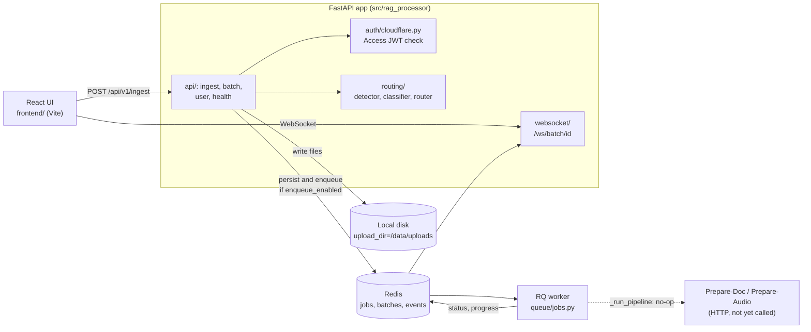

Ingest accepts uploads, identifies and classifies each file, picks a target pipeline, and tracks job status. The
processing step that would hand files to Prepare-Doc or Prepare-Audio is a stub. Context:
[Level 0](../level-0/index.md).

## Components

## Data flow

1. The UI posts one or more files to `POST /api/v1/ingest` (`api/ingest.py`). The request is authenticated with a
   Cloudflare Access JWT (`auth/cloudflare.py`).
2. Each file is validated, then written to `{upload_dir}/{batch_id}/` on local disk (`upload_dir` defaults to
   `/data/uploads`, `core/config.py`).
3. `routing/` detects the type from magic bytes (`detector.py`), splits PDFs into scanned and born-digital with
   pdfplumber (`classifier.py`), and maps the class to a target pipeline (`router.py`): scanned PDF and image to OCR,
   born-digital PDF and other documents to document processing, audio and video to transcription, unknown to none.
4. If `enqueue_enabled` is true (default off), the batch and jobs are saved to Redis and enqueued on RQ. Otherwise the
   upload returns and nothing is queued.
5. The RQ worker runs `process_job_task`, which calls `_run_pipeline` (`queue/jobs.py`). That function only logs a debug
   line. The job is then marked `COMPLETED` and batch progress is updated, so a completed job does not mean any
   downstream service saw the file.
6. The UI reads status from `GET /api/v1/batch/{batch_id}` and `GET /api/v1/batch/job/{job_id}` and live from
   `WS /ws/batch/{batch_id}`.

## Interfaces

| Interface | Direction | State |
| --- | --- | --- |
| `/health` | In | Built |
| `/api/v1/user` | In | Built |
| `POST /api/v1/ingest`, `GET /api/v1/ingest/health` | In | Built |
| `GET /api/v1/batch/{batch_id}`, `GET /api/v1/batch/job/{job_id}` | In | Built |
| `WS /ws/batch/{batch_id}` | In | Built |
| Prepare-Doc and Prepare-Audio HTTP calls | Out | Not built |
| Writes to shared object storage (`00-source/`) | Out | Not built |

`core/pipeline_config.py` and `config/pipelines.yaml` define outbound endpoints, but only the unit test imports the
loader; no application code does.

## Contract mismatches to resolve before wiring downstream

The Level 0 page describes Ingest writing the original upload to `00-source/` in S3-compatible storage, and the
contracts (`ingest-prepare-doc-contract.md`, `ingest-prepare-audio-contract.md` in
[image-preprocessing-detector](https://github.com/williaby/image-preprocessing-detector)) define the handoff. The code
differs:

- Uploads go to local disk, not object storage.
- `config/pipelines.yaml` names four endpoints: OCR (`:8001/api/v1/ocr`), transcription (`:8002/api/v1/transcribe`),
  document processing (`:8003/api/v1/extract`), and fusion (`:8004/api/v1/fuse`). These predate the current stage
  design. The real Prepare-Audio route is `POST /api/v1/process` (audio-processor `api/routes.py`), so the transcription
  URL does not match. The OCR, document, and fusion stages do not map to the current Prepare-Doc and Unify stages.
- The same file defines a Qdrant `vector_stores` entry, and `POST /api/v1/ingest` accepts a `target_vector_store` field.
  Vector storage belongs to downstream applications, not the pipeline, so both are legacy.
- Ingest has no `trace_id`-keyed layout yet; jobs are keyed by `batch_id` and `job_id`.

## Status

| Capability | Status |
| --- | --- |
| Upload, validation, local storage | Built |
| Cloudflare Access JWT auth | Built |
| Type detection and scanned vs born-digital classification | Built |
| Routing decision to a target pipeline | Built |
| Redis and RQ queue, worker, job and batch status | Built, enqueue off by default |
| WebSocket progress events | Built |
| React upload and status UI | Built (upload and status only) |
| Pipeline processing step (`_run_pipeline`) | Stub: logs only, job still marked complete |
| HTTP handoff to Prepare-Doc and Prepare-Audio | Not built |
| Object storage writes and `trace_id` layout | Not built |
